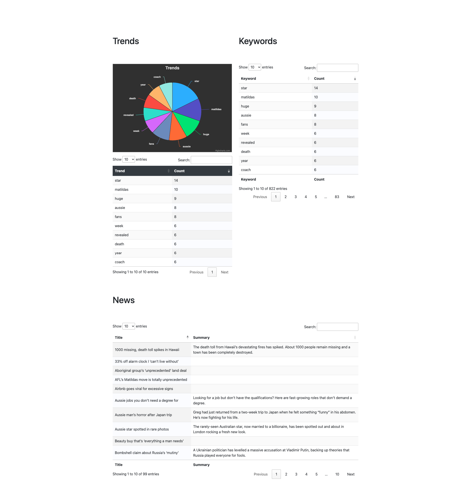

# Introduction.
A simple Php based web scraper for demo purpose.

## Task
-  Scrape the frontpage of a non-paywalled news site. eg: news.com.au
-  Create tables/pie charts/bar graphs/line graphs showing trends and keywords
-  Present table with headlines and articles summary
-  No frameworks for the frontend or backend
-  Vanilla JS, bootstrap, JQuery are acceptable for the frontend.
-  JS libraries are also fine. No webpack, gulp, node etc
-  PHP for the backend only
-  PHP to use API style response to JS fetch requests
-  PHP using functional/procedural style programming

# Install.
Simply execute,  
`docker-compose up -d`

# Webserver  
Webserver is running on port 8080.
To access it provide below url on your browser url bar.  
`http://127.0.0.1:8080`  
This will show a page with the current php info of the server.

# Docker 
There are two services.
- Nginx in webserver container
- Php in php container via php-fpm on port 9000

# API
API entry points are,
* http://127.0.0.1:8080/news
* http://127.0.0.1:8080/keywords

# Nginx
Nginx default config is located at `.docker/nginx/default.conf`

# Xdebug
Xdebug settings are at `.docker/php/conf.d/xdebug.ini`

# Final Preview
http://127.0.0.1:8080/index.html

